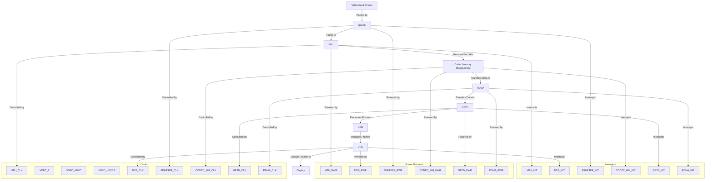
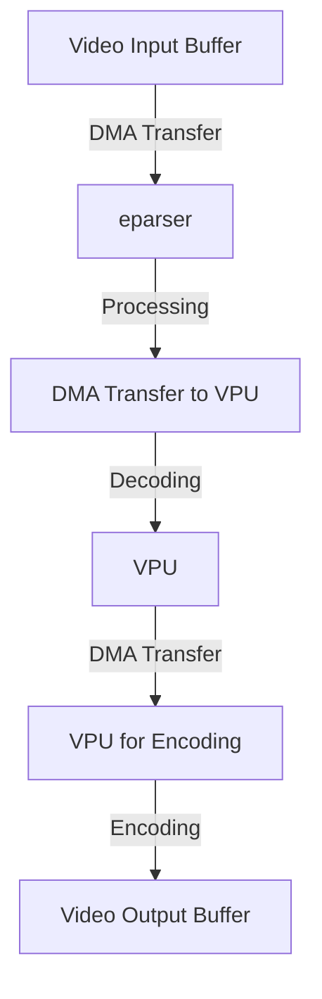
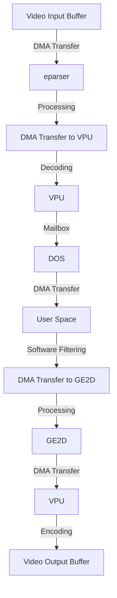

# Meson SoCs Video Processing

## Devices and Configuration

### VPU (Video Processing Unit)

The VPU (Video Processing Unit) is responsible for video decoding, encoding, and processing. The VPU supports a wide range of video codecs, including H.264, H.265, VP9, AV1, MPEG-2, MPEG-4, VC-1, and RealVideo. It also supports YUV formats (YUV420, YUV422, YUV444) and NV12 formats (NV12, NV21).

#### Registers and Configuration

**VPU_CTRL Register**
- Control register for VPU operation mode and settings.
- Address Offset: 0x0000

| Bits   | Value                  | Description |
|--------|------------------------|-------------|
| [31:24]| Reserved               | Reserved |
| [23:16]| 0x00: H.264            | Codec Type |
|        | 0x01: H.265            |             |
|        | 0x02: VP9              |             |
|        | 0x03: AV1              |             |
|        | 0x04: MPEG-2           |             |
|        | 0x05: MPEG-4           |             |
|        | 0x06: VC-1             |             |
|        | 0x07: RealVideo        |             |
| [15:8] | 0x00: Decode           | Operation Mode |
|        | 0x01: Encode           |             |
| [7:0]  | 0x00: Disable          | Enable/Disable VPU |
|        | 0x01: Enable           |             |

**VPU_STATUS Register**
- Status register providing current state and error information.
- Address Offset: 0x0004

| Bits   | Value                  | Description |
|--------|------------------------|-------------|
| [31:16]| Reserved               | Reserved |
| [15:8] | 0x00 - 0xFF            | Error Code |
| [7:0]  | 0x00 - 0xFF            | Current State |

**VPU_DATA Register**
- Data register for transferring video data to and from the VPU.
- Address Offset: 0x0008

| Bits   | Value                  | Description |
|--------|------------------------|-------------|
| [31:0] | 0x00000000 - 0xFFFFFFFF| Video Data |

**VPU_YUV_FORMAT Register**
- Register for configuring YUV and NV12 formats.
- Address Offset: 0x000C

| Bits   | Value                  | Description |
|--------|------------------------|-------------|
| [31:16]| Reserved               | Reserved |
| [15:8] | 0x00: YUV420           | YUV Format |
|        | 0x01: YUV422           |             |
|        | 0x02: YUV444           |             |
| [7:0]  | 0x00: NV12             | NV12 Format |
|        | 0x01: NV21             |             |

#### Clocks

| Name         | Source Clock | Divider | Description |
|--------------|--------------|---------|-------------|
| VPU_CLK      | PLL1         | 2       | Main clock for the VPU |
| VDEC_1       | PLL2         | 2       | Clock for VPU decoding |
| VDEC_HEVC    | PLL3         | 2       | Clock for HEVC decoding |
| VDEC_HEVCF   | PLL4         | 2       | Clock for HEVCF decoding |

#### Power Domains

| Name    | Address | Bits | Value | Description |
|---------|---------|------|-------|-------------|
| VPU_PWR | 0x1000  | [0]  | 0: Off, 1: On | Power domain for the VPU |

#### Interrupts

| Name    | Number | Description |
|---------|--------|-------------|
| VPU_INT | 32     | Interrupt line for the VPU |

---

### DOS (Decoder Output Stage)

The DOS (Decoder Output Stage) is involved in the final stages of video decoding, handling the output of decoded video frames.

#### Registers and Configuration

**DOS_CTRL Register**
- Control register for DOS operation mode and settings.
- Address Offset: 0x1000

| Bits   | Value                  | Description |
|--------|------------------------|-------------|
| [31:24]| Reserved               | Reserved |
| [23:16]| 0x00: YUV              | Output Format |
|        | 0x01: RGB              |             |
| [15:8] | 0x00: 1080p            | Resolution |
|        | 0x01: 4K               |             |
| [7:0]  | 0x00: Disable          | Enable/Disable DOS |
|        | 0x01: Enable           |             |

**DOS_STATUS Register**
- Status register providing current state and error information.
- Address Offset: 0x1004

| Bits   | Value                  | Description |
|--------|------------------------|-------------|
| [31:16]| Reserved               | Reserved |
| [15:8] | 0x00 - 0xFF            | Error Code |
| [7:0]  | 0x00 - 0xFF            | Current State |

**DOS_OUTPUT Register**
- Output register for configuring the output format and resolution.
- Address Offset: 0x1008

| Bits   | Value                  | Description |
|--------|------------------------|-------------|
| [31:0] | 0x00000000 - 0xFFFFFFFF| Output Data |

**DOS_MAILBOX_0 Register**
- Mailbox register for controlling video encoding/decoding.
- Address Offset: 0x1010

| Bits   | Value                  | Description |
|--------|------------------------|-------------|
| [31:0] | 0x00000000 - 0xFFFFFFFF| Mailbox Data |

**DOS_MAILBOX_1 Register**
- Mailbox register for controlling video encoding/decoding.
- Address Offset: 0x1014

| Bits   | Value                  | Description |
|--------|------------------------|-------------|
| [31:0] | 0x00000000 - 0xFFFFFFFF| Mailbox Data |

**DOS_MAILBOX_2 Register**
- Mailbox register for controlling video encoding/decoding.
- Address Offset: 0x1018

| Bits   | Value                  | Description |
|--------|------------------------|-------------|
| [31:0] | 0x00000000 - 0xFFFFFFFF| Mailbox Data |

#### Clocks

| Name     | Source Clock | Divider | Description |
|----------|--------------|---------|-------------|
| DOS_CLK  | PLL1         | 2       | Main clock for the DOS |

#### Power Domains

| Name    | Address | Bits | Value | Description |
|---------|---------|------|-------|-------------|
| DOS_PWR | 0x2000  | [0]  | 0: Off, 1: On | Power domain for the DOS |

#### Interrupts

| Name          | Number | Description |
|---------------|--------|-------------|
| DOS_INT       | 33     | Interrupt line for the DOS |
| DOS_MAILBOX_0 | 34     | Interrupt for DOS Mailbox 0 |
| DOS_MAILBOX_1 | 35     | Interrupt for DOS Mailbox 1 |
| DOS_MAILBOX_2 | 36     | Interrupt for DOS Mailbox 2 |

---

### eparser (Elementary Stream Parser)

The eparser (Elementary Stream Parser) is responsible for parsing elementary video streams, extracting video frames, and feeding them to the decoder.

#### Registers and Configuration

**EPARSER_CTRL Register**
- Control register for eparser operation mode and settings.
- Address Offset: 0x2000

| Bits   | Value                  | Description |
|--------|------------------------|-------------|
| [31:24]| Reserved               | Reserved |
| [23:16]| 0x00: MPEG             | Stream Type |
|        | 0x01: H.264            |             |
|        | 0x02: H.265            |             |
| [15:8] | 0x00: TS               | Stream Format |
|        | 0x01: ES               |             |
| [7:0]  | 0x00: Disable          | Enable/Disable eparser |
|        | 0x01: Enable           |             |

**EPARSER_STATUS Register**
- Status register providing current state and error information.
- Address Offset: 0x2004

| Bits   | Value                  | Description |
|--------|------------------------|-------------|
| [31:16]| Reserved               | Reserved |
| [15:8] | 0x00 - 0xFF            | Error Code |
| [7:0]  | 0x00 - 0xFF            | Current State |

**EPARSER_STREAM Register**
- Stream register for configuring the input stream format.
- Address Offset: 0x2008

| Bits   | Value                  | Description |
|--------|------------------------|-------------|
| [31:0] | 0x00000000 - 0xFFFFFFFF| Stream Data |

#### Clocks

| Name         | Source Clock | Divider | Description |
|--------------|--------------|---------|-------------|
| EPARSER_CLK  | PLL1         | 2       | Main clock for the eparser |

#### Power Domains

| Name         | Address | Bits | Value | Description |
|--------------|---------|------|-------|-------------|
| EPARSER_PWR  | 0x3000  | [0]  | 0: Off, 1: On | Power domain for the eparser |

#### Interrupts

| Name         | Number | Description |
|--------------|--------|-------------|
| EPARSER_INT  | 34     | Interrupt line for the eparser |

---

### Codec Memory Management

Codec memory management is crucial for allocating and managing memory for video codecs. It ensures efficient use of memory resources during video processing.

#### Registers and Configuration

**CODEC_MM_CTRL Register**
- Control register for codec memory management operation mode and settings.
- Address Offset: 0x3000

| Bits   | Value                  | Description |
|--------|------------------------|-------------|
| [31:24]| Reserved               | Reserved |
| [23:16]| 0x00: Pool 1           | Memory Pool |
|        | 0x01: Pool 2           |             |
| [15:8] | 0x00: Strategy 1       | Allocation Strategy |
|        | 0x01: Strategy 2       |             |
| [7:0]  | 0x00: Disable          | Enable/Disable Codec MM |
|        | 0x01: Enable           |             |

**CODEC_MM_STATUS Register**
- Status register providing current state and error information.
- Address Offset: 0x3004

| Bits   | Value                  | Description |
|--------|------------------------|-------------|
| [31:16]| Reserved               | Reserved |
| [15:8] | 0x00 - 0xFF            | Error Code |
| [7:0]  | 0x00 - 0xFF            | Current State |

**CODEC_MM_DATA Register**
- Data register for transferring memory data.
- Address Offset: 0x3008

| Bits   | Value                  | Description |
|--------|------------------------|-------------|
| [31:0] | 0x00000000 - 0xFFFFFFFF| Memory Data |

#### Clocks

| Name         | Source Clock | Divider | Description |
|--------------|--------------|---------|-------------|
| CODEC_MM_CLK | PLL1         | 2       | Main clock for codec memory management |

#### Power Domains

| Name         | Address | Bits | Value | Description |
|--------------|---------|------|-------|-------------|
| CODEC_MM_PWR | 0x4000  | [0]  | 0: Off, 1: On | Power domain for codec memory management |

#### Interrupts

| Name         | Number | Description |
|--------------|--------|-------------|
| CODEC_MM_INT | 35     | Interrupt line for codec memory management |

---

### GE2D (Graphics Engine 2D)

The GE2D module handles 2D graphics processing and video frame manipulation. It might be used for tasks like scaling, blending, and color conversion.

#### Registers and Configuration

**GE2D_CTRL Register**
- Control register for GE2D operation mode and settings.
- Address Offset: 0x4000

| Bits   | Value                  | Description |
|--------|------------------------|-------------|
| [31:24]| Reserved               | Reserved |
| [23:16]| 0x00: Scaling          | Operation Mode |
|        | 0x01: Blending         |             |
| [15:8] | 0x00: RGB              | Color Format |
|        | 0x01: YUV              |             |
| [7:0]  | 0x00: Disable          | Enable/Disable GE2D |
|        | 0x01: Enable           |             |

**GE2D_STATUS Register**
- Status register providing current state and error information.
- Address Offset: 0x4004

| Bits   | Value                  | Description |
|--------|------------------------|-------------|
| [31:16]| Reserved               | Reserved |
| [15:8] | 0x00 - 0xFF            | Error Code |
| [7:0]  | 0x00 - 0xFF            | Current State |

**GE2D_DATA Register**
- Data register for transferring video frame data to and from the GE2D.
- Address Offset: 0x4008

| Bits   | Value                  | Description |
|--------|------------------------|-------------|
| [31:0] | 0x00000000 - 0xFFFFFFFF| Frame Data |

#### Clocks

| Name         | Source Clock | Divider | Description |
|--------------|--------------|---------|-------------|
| GE2D_CLK     | PLL1         | 2       | Main clock for the GE2D |

#### Power Domains

| Name         | Address | Bits | Value | Description |
|--------------|---------|------|-------|-------------|
| GE2D_PWR     | 0x5000  | [0]  | 0: Off, 1: On | Power domain for the GE2D |

#### Interrupts

| Name         | Number | Description |
|--------------|--------|-------------|
| GE2D_INT     | 36     | Interrupt line for the GE2D |

---

### RDMA (Remote Direct Memory Access)

The RDMA module facilitates efficient data transfer between memory and video processing units, reducing CPU overhead.

#### Registers and Configuration

**RDMA_CTRL Register**
- Control register for RDMA operation mode and settings.
- Address Offset: 0x5000

| Bits   | Value                  | Description |
|--------|------------------------|-------------|
| [31:24]| Reserved               | Reserved |
| [23:16]| 0x00: Transfer 1       | Transfer Configuration |
|        | 0x01: Transfer 2       |             |
| [15:8] | 0x00: Mode 1           | Operation Mode |
|        | 0x01: Mode 2           |             |
| [7:0]  | 0x00: Disable          | Enable/Disable RDMA |
|        | 0x01: Enable           |             |

**RDMA_STATUS Register**
- Status register providing current state and error information.
- Address Offset: 0x5004

| Bits   | Value                  | Description |
|--------|------------------------|-------------|
| [31:16]| Reserved               | Reserved |
| [15:8] | 0x00 - 0xFF            | Error Code |
| [7:0]  | 0x00 - 0xFF            | Current State |

**RDMA_DATA Register**
- Data register for transferring memory data.
- Address Offset: 0x5008

| Bits   | Value                  | Description |
|--------|------------------------|-------------|
| [31:0] | 0x00000000 - 0xFFFFFFFF| Memory Data |

#### Clocks

| Name         | Source Clock | Divider | Description |
|--------------|--------------|---------|-------------|
| RDMA_CLK     | PLL1         | 2       | Main clock for RDMA |

#### Power Domains

| Name         | Address | Bits | Value | Description |
|--------------|---------|------|-------|-------------|
| RDMA_PWR     | 0x6000  | [0]  | 0: Off, 1: On | Power domain for RDMA |

#### Interrupts

Name 	Number 	Description 	
RDMA_INT 	37 	Interrupt line for RDMA 	

---

### VFM (Video Frame Manager)
The VFM module manages video frames and their processing, ensuring smooth playback and synchronization.

#### Registers and Configuration
**VFM_CTRL Register**
- Control register for VFM operation mode and settings.
- Address Offset: 0x6000

Bits 	Value 	Description 	
[31:24] 	Reserved 	Reserved 	
[23:16] 	0x00: Buffer 1 	Frame Buffer 	
 	0x01: Buffer 2 	 	
[15:8] 	0x00: Sync 1 	Synchronization Mode 	
 	0x01: Sync 2 	 	
[7:0] 	0x00: Disable 	Enable/Disable VFM 	
 	0x01: Enable 	 	

**VFM_STATUS Register**
- Status register providing current state and error information.
- Address Offset: 0x6004

Bits 	Value 	Description 	
[31:16] 	Reserved 	Reserved 	
[15:8] 	0x00 - 0xFF 	Error Code 	
[7:0] 	0x00 - 0xFF 	Current State 	

**VFM_DATA Register**
- Data register for transferring video frame data.
- Address Offset: 0x6008

Bits 	Value 	Description 	
[31:0] 	0x00000000 - 0xFFFFFFFF 	Frame Data 	

#### Clocks
Name 	Source Clock 	Divider 	Description 	
VFM_CLK 	PLL1 	2 	Main clock for VFM 	

#### Power Domains
Name 	Address 	Bits 	Value 	Description 	
VFM_PWR 	0x7000 	[0] 	0: Off, 1: On 	Power domain for VFM 	

#### Interrupts
Name 	Number 	Description 	
VFM_INT 	38 	Interrupt line for VFM 	


## Workflows and Diagrams

The following diagrams illustrate how the different components work together in video processing.

### Decoding Video to Display

This diagram shows the flow of video data through the various components involved in video processing, along with the associated clocks, power domains, and interrupts.



### Simple Hardware Codec Conversion (from Codec A to Codec B)

```mermaid
graph TD
    A[Video Input (A)] -->|Decodes| B[VPU]
    B -->|Encodes| C[Video Output (B)]
```

#### Detailed Workflow of Simple Transcoding

- Video Input Buffer

This detailed workflow and diagrams illustrate the simple transcoding process on Meson SoCs, showing how video content is processed through various components, including DMA transfers, hardware decoding/encoding, and optimizations using embedded features.

- Video Input Buffer: The video content is initially stored in a memory buffer. This buffer could be in system memory (RAM) or a dedicated video memory.
- DMA Transfer to eparser: The video content is transferred from the input buffer to the eparser using DMA (Direct Memory Access). This transfer is efficient and offloads the CPU.
- eparser Processing: The eparser parses the elementary video stream, extracting video frames and metadata. It prepares the data for decoding.
- Memory Transfer to VPU: The parsed video data is transferred to the VPU for decoding. This transfer could be done using DMA or through shared memory.
- VPU Decoding: The VPU decodes the video frames into an intermediate format, such as NV12. This format is suitable for further processing.
- Memory Transfer to VPU for Encoding: The decoded frames are transferred back to the VPU for encoding. This transfer could be done using DMA or through shared memory.
- VPU Encoding: The VPU encodes the processed video frames into the desired output format (e.g., H.264, H.265).
- Video Output Buffer: The encoded video content is stored in an output buffer, ready for display or further processing.
Optimizations Using Embedded Features of Meson SoCs- DMA Transfers: Using DMA for memory transfers reduces CPU overhead and improves efficiency.
- Shared Memory: Utilizing shared memory between components (e.g., eparser and VPU) minimizes memory copying and reduces latency.
- Hardware Acceleration: Leveraging hardware acceleration for decoding and encoding (VPU) speeds up the transcoding process.
- Intermediate Formats: Using intermediate formats like NV12 optimizes memory usage and simplifies processing.



### Hardware Codec Conversion with HW Filters (e.g., resizing, cropping, HDR to SDR)

```mermaid
graph TD
    A[Video Input (A)] -->|Decodes| B[VPU]
    B -->|Processes| C[GE2D]
    C -->|Encodes| D[Video Output (B)]
    C -->|Filters (Resizing, Cropping, HDR to SDR)| D
```

### Complex Transcod```mermaiding with HW Decoding to NV12, Software Filter, Hardware Filter, and HW Encoding

```mermaid
graph TD
    A[Video Input (A)] -->|Decodes to NV12| B[VPU]
    B -->|Processes| C[Software Filter]
    C -->|Processes| D[GE2D]
    D -->|Encodes| E[Video Output (B)]
    D -->|HW Filters| E
```

#### Detailed Workflow of Complex Transcoding

This detailed workflow and diagrams illustrate the complex transcoding process, showing how video content is processed through various components, including DMA transfers, hardware decoding/encoding, and software/hardware filtering.

- Video Input Buffer: The video content is initially stored in a memory buffer. This buffer could be in system memory (RAM) or a dedicated video memory.
- DMA Transfer to eparser: The video content is transferred from the input buffer to the eparser using DMA (Direct Memory Access). This transfer is efficient and offloads the CPU.
- eparser Processing: The eparser parses the elementary video stream, extracting video frames and metadata. It prepares the data for decoding.
- Memory Transfer to VPU: The parsed video data is transferred to the VPU for decoding. This transfer could be done using DMA or through shared memory.
- VPU Decoding: The VPU decodes the video frames into an intermediate format, such as NV12. This format is suitable for further processing.
- DOS Mailbox: The decoded video frames are sent to the DOS (Decoder Output Stage) via mailboxes. The DOS handles the output of decoded frames.
- DMA Transfer to User Space: The decoded frames are transferred to user space for software filtering. This transfer is typically done using DMA.
- Software Filtering: In user space, software filters are applied to the video frames. These filters could include resizing, cropping, color correction, etc.
- DMA Transfer to GE2D: The filtered video frames are transferred back to the hardware for further processing. This transfer is done using DMA.
- GE2D Processing: The GE2D (Graphics Engine 2D) applies hardware filters to the video frames. These filters could include scaling, blending, and color conversion.
- Memory Transfer to VPU: The processed video frames are transferred back to the VPU for encoding. This transfer could be done using DMA or through shared memory.
- VPU Encoding: The VPU encodes the processed video frames into the desired output format (e.g., H.264, H.265).
- Video Output Buffer: The encoded video content is stored in an output buffer, ready for display or further processing.


